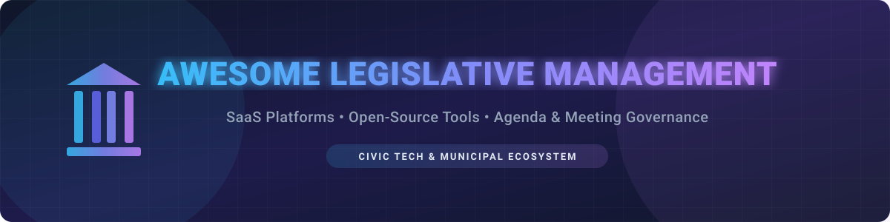

  

# 🏛️ Awesome Legislative Management Platforms & Tools 📜

  
  
  
  

> 💡 A curated ecosystem guide to top **Legislative Management Software**, municipal **Agenda Management platforms**, board governance tools, and open-source civic technology.

Welcome to the comprehensive directory for **Legislative Management Systems (LMS)** 🏛️, council meeting automation 🤖, public records publishing 📄, agenda packet preparation 📁, and civic transparency software 🌐. This guide covers commercial SaaS enterprise platforms and open-source GitHub repositories designed for local governments, city councils, school boards, and clerks.

---

## 📑 Table of Contents

- [📊 Market Landscape & Overview](#-market-landscape--overview)
- [💼 SaaS & Hosted Platforms](#-saas--hosted-platforms)
- [🔓 Open-Source GitHub Projects](#-open-source-github-projects)
- [🔍 Key Features to Evaluate](#-key-features-to-evaluate)
- [🤝 How to Contribute](#-how-to-contribute)
- [❤️ Support & Sponsorship](#%EF%B8%8F-support--sponsorship)
- [📈 Star History](#-star-history)
- [⚠️ Disclaimer](#%EF%B8%8F-disclaimer)

---

## 📊 Market Landscape & Overview

> **Market Size & Structure**: The global **Government Tech (GovTech) & Legislative Management software market** is estimated at **$2.5 Billion – $3.5 Billion**, driven by digital government initiatives, public records compliance, and hybrid municipal meeting standards. The sector is **moderately to highly concentrated**, dominated by major PE-backed consolidators like **Granicus**, **Diligent**, and **CivicPlus** that regularly acquire regional SaaS vendors (e.g., Novus Agenda, PrimeGov, IQM2) to form end-to-end municipal governance suites.

---

## 💼 SaaS & Hosted Platforms

Below is a comparison of top commercial legislative management platforms, sorted by estimated **company size (revenue / valuation)** in descending order.

| Platform | Company Size (Revenue / Valuation) | Pricing (Starting Tier) | Free Tier / Trial Limits | Description & Key Strengths |
| :--- | :--- | :--- | :--- | :--- |
| **[Granicus Legistar](https://granicus.com/)** | **~$4 Billion Valuation** (~$175M EBITDA) | $10,000 / year (Modular tiering) | 30-Day Guided Enterprise Sandbox Demo | 🏢 Leading government experience and legislative management suite for agendas, vote tracking, video streaming, and public portals. |
| **[Diligent Community](https://www.diligent.com/)** | **~$500 Million+ ARR** | $3,600 / year (Standard board tier) | 14-Day Free Trial (Limited to 1 board/committee) | 🛡️ Enterprise board governance and community management platform supporting workflow approvals, agenda packets, and security control. |
| **[CivicClerk (CivicPlus)](https://www.civicplus.com/)** | **~$250 Million Revenue** | $4,500 / year (Municipal Select tier) | 14-Day Guided Trial | 🏛️ Integrated agenda, minutes, and public meeting management system built specifically for municipal clerks and local authorities. |
| **[BoardDocs](https://www.boarddocs.com/)** | **~$30 Million Revenue** (Diligent Subsidiary) | $3,000 / year (Paperless Pro tier) | 30-Day Free Trial (Up to 3 active meeting packets) | 🎓 Cloud-based board management solution widely used by public school boards, community colleges, and local governments. |
| **[PrimeGov](https://www.primegov.com/)** | **~$15 Million Revenue** (Granicus / OneMeeting) | $8,000 / year (Core Agenda tier) | 14-Day Guided Sandbox Trial | ⚡ Modern agenda automation and voting workflow platform designed for local government clerks and council administrators. |
| **[eScribe](https://www.escribemeetings.com/)** | **~$12 Million Revenue** | $5,000 / year (Essentials tier) | 14-Day Free Trial (Basic agenda builder access) | 📝 Comprehensive meeting management and public portal solution for municipal councils, boards, and public commissions. |
| **[CitySourced Council](https://www.citysourced.com/)** | **~$5 Million Revenue** (Rock Solid Tech) | $2,400 / year (Council tier) | 30-Day Free Trial (Up to 50 constituent reports) | 📱 Civic engagement and council management tool integrating meeting agendas, citizen requests, and mobile workflows. |
| **[IQM2](https://www.iqm2.com/)** | **~$5 Million Revenue** (Granicus MinuteTraq) | $6,000 / year (MinuteTraq tier) | 30-Day Enterprise Trial Demo | ⏱️ Agenda preparation, automated minute taking, and digital roll-call software tailored for local municipal boards. |
| **[Novus Agenda](https://www.novusagenda.com/)** | **~$4 Million Revenue** (Granicus Suite) | $4,000 / year (Standard Agenda tier) | 14-Day Enterprise Demo Access | 📂 Structured meeting packet creation, document routing, and legislative tracking software for public entities. |
| **[MeetingKing](https://meetingking.com/)** | **~$1 Million Revenue** | $119.40 / year ($9.95/month Pro Single) | 14-Day Full-Featured Free Trial (No credit card required) | 👑 Lightweight meeting agenda builder, action item tracking, and minute generation software for small boards and teams. |

---

## 🔓 Open-Source GitHub Projects

The following open-source projects provide transparency tools, agenda scrapers, legislative tracking, and e-participation platforms. Repositories are sorted by **GitHub Star Count** (descending).

- **[consuldemocracy/consuldemocracy](https://github.com/consuldemocracy/consuldemocracy)**   
  *Consul Democracy is one of the most complete open-source e-participation and civic governance platforms used by governments worldwide for citizen proposals, voting, and debate.* 🌐

- **[decidim/decidim](https://github.com/decidim/decidim)**   
  *Participatory governance framework built on Ruby on Rails for cities and organizations to manage public consultations, legislative proposals, and strategic planning.* 🗳️

- **[unitedstates/congress](https://github.com/unitedstates/congress)**   
  *Public domain data collectors and scrapers for federal legislative data, tracking Congress bills, roll call votes, amendments, and committee schedules.* 🇺🇸

- **[openstates/openstates-scrapers](https://github.com/openstates/openstates-scrapers)**   
  *Scrapers and data processing scripts collecting state-level legislative data, bills, legislators, and voting records across all 50 US states.* 🗺️

- **[opengovfoundation/madison](https://github.com/opengovfoundation/madison)**   
  *Open policy co-creation platform enabling lawmakers to share draft legislation publicly so citizens can comment, annotate, and suggest edits line-by-line.* ✏️

- **[openelections/openelections-core](https://github.com/openelections/openelections-core)**   
  *Core framework for acquiring, transforming, and publishing certified election results and voting records for public auditability.* 🗳️

- **[frappe/meeting](https://github.com/frappe/meeting)**   
  *Open-source meeting workflow app built on Frappe Framework for scheduling agendas, managing attendees, and logging structured meeting minutes.* 📅

- **[datamade/chi-councilmatic](https://github.com/datamade/chi-councilmatic)**   
  *City Councilmatic instance tracking Chicago City Council agendas, aldermanic votes, committee meetings, and legislative documents.* 🏙️

- **[driki/muni-meeting](https://github.com/driki/muni-meeting)**   
  *Dedicated open-source meeting and agenda management application designed specifically for municipal council meeting preparation and records.* 📜

- **[front-seat/engage](https://github.com/front-seat/engage)**   
  *Civic-tech project that parses city council agendas, extracts legislative topics, and generates AI-driven public summaries for citizens.* 🤖

---

## 🔍 Key Features to Evaluate

When selecting a Legislative Management System or civic agenda software, government entities and civic leaders evaluate:

1. 📁 **Agenda Packet Builder**: Automated PDF assembly, item numbering, sponsor tagging, and attachment management.
2. 🗳️ **Roll-Call & In-Meeting Voting**: Live voting interface, attendance tracking, and instant minute logging.
3. 🌐 **Public Access Portal**: Searchable archives of past meetings, video indexing, and legislative bill tracking.
4. ⚖️ **Compliance & Legal Notice**: Sunshine law compliance, public posting deadline tracking, and open records retention.
5. 💬 **e-Participation & Feedback**: Online public comment submission during draft legislative reviews.

---

## 🤝 How to Contribute

Contributions are highly encouraged! To contribute to this curated list:

1. 🍴 Fork this repository.
2. 📝 Add your suggested SaaS tool or Open-Source project to `README.md`.
3. ⭐ Ensure open-source projects include star count badge syntax linked to stargazers.
4. 🕊️ Maintain factual, neutral descriptions with valid links.
5. 🚀 Create a Pull Request with a clear description of changes.

---

## ❤️ Support & Sponsorship

Thank you for exploring and utilizing the **Awesome Legislative Management** directory! 🌟

If you find this repository valuable for your research, municipality, or civic tech project, please consider supporting the project:

- ⭐ **Star this repository** to increase visibility for open government technology.
- 🔀 **Fork & Share** with municipal clerks, civic technologists, and public administrators.
- ☕ **Sponsor / Buy Me a Coffee**: Help sustain open-source civic tech curation by sponsoring via [GitHub Sponsors Dashboard](https://github.com/sponsors/ishandutta2007).

---

## 📈 Star History

---

## ⚠️ Disclaimer

- This directory is **community-curated** for informational and educational purposes.
- Market valuations, company sizes, and software pricing figures are estimates derived from public records, procurement contracts, and market research reports as of 2026.
- Public sector organizations should conduct formal procurement requests (RFP/RFI) and legal compliance checks prior to selecting legislative management software.

---

**Maintained with ❤️ for municipal clerks, city council members, civic hackers, and public policy leaders.** 🏛️✨
